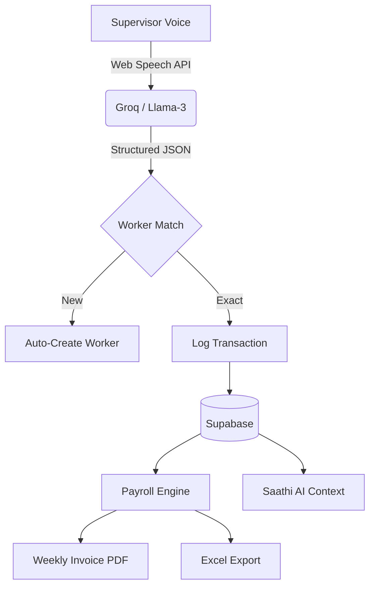

# VedaVoice — The Voice-First Financial OS for Site Supervisors

> *"Hisaab likho mat, bolo."* (Don't write the accounts, speak them.)

VedaVoice is a professional-grade **Audit & Payroll Ledger** designed specifically for the high-pressure, chaotic environment of Indian construction sites. It replaces messy diaries and prone-to-error Excel sheets with a hands-free, voice-first system that handles attendance, advances, and final settlements in natural Hinglish.

---

## ⚡ Why VedaVoice is Unique
**There is no other product on the market built for the Site Foreman's reality.**

1.  **Sub-Second Intent Extraction**: Powered by **Llama-3 (Groq LPUs)**, VedaVoice understands site slang, context-heavy deductions, and Hindi numbering (e.g., "Sawa teen sau") in under 500ms.
2.  **Zero-Friction Onboarding**: No complex forms. Workers are automatically created the moment you mention their name in a voice command.
3.  **The "Thekedar" Financial Standard**: Unlike generic accounting apps, VedaVoice uses the rigorous Site-Supervisor formula: `Gross Earned − (Advance + Paid) = Net Dena Baki`.
4.  **BOM-Safe Hindi Exports**: We use **UTF-8 BOM encoding** to ensure that Devanagari names and Hinglish transcripts appear perfectly in Microsoft Excel—solving a critical character-encoding pain point for Indian supervisors.
5.  **Audit-Ready Weekly Receipts**: Automatically buckets attendance and payments into ISO-week groups with running balances, ready to print as professional receipts with worker/supervisor signature lines.

---

## 🛠️ The Tech Hierarchy

| Layer | Technology | Problem it Solves |
|---|---|---|
| **Voice Brain** | Llama-3.3-70B (Groq) | Instant intent parsing from Hinglish speech |
| **Data Core** | Supabase (PostgreSQL) | Real-time synchronization across site teams |
| **Finance Engine**| Custom TS `finance.ts` | Handles splitting overpayments into new advances automatically |
| **Reporting** | UTF-8 BOM + @media print | Professional PDF receipts and Excel auditing |
| **AI Saathi** | Gemini 1.5 Flash | AI that remembers the last 7 days of site activity |

---

## 💎 High-Impact Features

### 🎙️ The Voice-to-Ledger Engine
Speak naturally. The system extracts structured entities, handles deduplication, and maps transactions to existing workers or creates new ones on the fly.
- *Input:* "Raju ka 500 advance diya, 50 khane mein kata"
- *Output:* `Amount: 450`, `Action: ADVANCE`, `Note: 50 deducted for food`

### 🗓️ Smart Hajiri (Attendance)
Mark attendance for the whole site with one tap or a voice command. 
- **Status Weighted Weights**: Present (1.0) · Half Day (0.5) · Absent (0.0)
- **Daily Site Bill**: Real-time calculation of exactly how much money is "earned" on site today.

### 🏧 The Smart Settlement Engine
VedaVoice prevents the "Negative Balance" bug. If you pay a worker more than their current `Net Baki`, the system automatically:
1.  Creates a **PAYMENT** to settle the current debt.
2.  Creates a new **ADVANCE** for the surplus.
*This maintains a clean Audit Trail for every rupee.*

### 📄 Audit-Ready Weekly Invoices
Move to `/workers/[id]` to generate a professional weekly breakdown. 
- Chronological grouping by ISO Weeks.
- Running balance carry-over.
- **Physical Handover**: Print-ready layout with signature lines for the site manager and worker.

---

## 🏗️ Technical Architecture



---

## 🚀 Getting Started

### 1. Requirements
- Node.js 18+
- Supabase Project
- Groq API Key (for sub-second extraction)
- Gemini API Key (for Saathi AI)

### 2. Installation
```bash
git clone https://github.com/your-org/vedavoice
cd vedavoice
npm install
npm run dev
```

### 3. Database Sync (SQL Editor)
```sql
-- Core Worker Schema
CREATE TABLE workers (
  id uuid PRIMARY KEY DEFAULT gen_random_uuid(),
  user_id uuid REFERENCES auth.users,
  name text NOT NULL,
  qualifier text, -- Handles "Delhi wala Raju"
  daily_rate integer,
  phone text,
  created_at timestamptz DEFAULT now()
);

-- Transaction Audit Trail
ALTER TABLE transactions
  ADD COLUMN worker_id uuid REFERENCES workers(id),
  ADD COLUMN transcript text, -- Preserves original voice record
  ADD COLUMN action text CHECK (action IN ('ADVANCE', 'PAYMENT', 'MATERIAL', 'RECEIPT'));
```

---

## 📋 The Development Manifesto

VedaVoice was built with **Performance & Precision** as primary goals:
- **No Placeholders**: Every feature, from the CSV export to the AI chatbot, is fully functional with real data.
- **Site-First Design**: High-contrast components, large touch targets, and a mobile-bottom navigation designed for outdoors.
- **Hindi-First Intelligence**: Saathi AI is grounded in the last 7 days of site operations, meaning it knows *exactly* who is owed money today.

---

*Built for Mind Installers Hackathon 4.0 · April 2026*