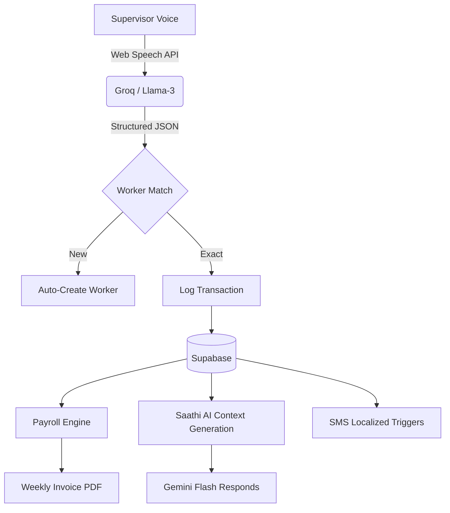

# Parchi — The Voice-First Financial OS for Site Supervisors

> *"Hisaab likho mat, bolo."* (Don't write the accounts, speak them.)

Parchi is a professional-grade **Audit & Payroll Ledger** designed specifically for the high-pressure, chaotic environment of Indian construction sites. It replaces messy diaries and prone-to-error Excel sheets with a hands-free, voice-first system that handles attendance, advances, final settlements, and even translated SMS verifications in natural Hinglish.

---

## ⚡ Why Parchi is Unique
**There is no other product on the market built for the Site Foreman's reality.**

1.  **Sub-Second Intent Extraction**: Powered by **Llama-3 (Groq LPUs)**, Parchi understands site slang, context-heavy deductions, and Hindi numbering (e.g., "Sawa teen sau") in under 500ms.
2.  **Zero-Friction Onboarding**: No complex forms. Workers are automatically created the moment you mention their name in a voice command.
3.  **The "Thekedar" Financial Standard**: Unlike generic accounting apps, Parchi uses the rigorous Site-Supervisor formula: `Gross Earned − (Advance + Paid) = Net Dena Baki`.
4.  **Multi-Language SMS Verification**: With integrated Twilio templates, Parchi sends receipts to workers in their preferred language (Hindi, Marathi, Gujarati, Bengali, Hinglish, English) to confirm payments.
5.  **Smart Transliteration API**: Built-in dynamic transliteration allows effortless syncing of complex Devanagari regional names into standard cached English representations. 
6.  **Audit-Ready Weekly Receipts**: Automatically buckets attendance and payments into ISO-week groups with running balances.
7.  **Proxy Middleware Auth**: Secure UI cookie-based middleware ensures stable session redirects without heavy loading blocks.

---

## 🛠️ The Tech Hierarchy

| Layer | Technology | Problem it Solves |
|---|---|---|
| **Voice Brain** | Llama-3.3-70B (Groq) | Instant intent parsing from Hinglish speech |
| **Data Core** | Supabase (PostgreSQL) | Real-time synchronization & Name transliteration caching |
| **Finance Engine**| Custom TS `finance.ts` | Handles splitting overpayments into new advances automatically |
| **Notifications** | Twilio API SDK | Localized SMS receipt verification for 6 languages |
| **AI Saathi** | Gemini 1.5 Flash | Conversational AI that interprets 7-day site analytics contexts |

---

## 💎 High-Impact Features

### 🎙️ The Voice-to-Ledger Engine
Speak naturally. The system extracts structured entities, handles deduplication, and maps transactions to existing workers or creates new ones on the fly.
- *Input:* "Raju ka 500 advance diya, 50 khane mein kata"
- *Output:* `Amount: 450`, `Action: ADVANCE`, `Note: 50 deducted for food`

### 🤖 Saathi Context-Aware AI Chatbot
Built atop Google Gemini, your "Saathi" (companion) bot lives directly in the platform. Using custom context-building libraries (`saathiContext.ts`), Saathi tracks the last 7 days of site activity. By simply asking, "Who was absent yesterday?" or "How much have we paid so far?", Saathi immediately looks at live worker rates, transactions, and attendances to respond accurately.

### 🗓️ Smart Hajiri (Attendance)
Mark attendance for the whole site with one tap or a voice command. 
- **Status Weighted Weights**: Present (1.0) · Half Day (0.5) · Absent (0.0)
- **Daily Site Bill**: Real-time calculation of exactly how much money is "earned" on site today.

### 🏧 The Smart Settlement Engine
Parchi prevents the "Negative Balance" bug. If you pay a worker more than their current `Net Baki`, the system automatically:
1.  Creates a **PAYMENT** to settle the current debt.
2.  Creates a new **ADVANCE** for the surplus.
*This maintains a clean Audit Trail for every rupee.*

### 📄 Audit-Ready Weekly Invoices
Move to `/workers/[id]` to generate a professional weekly breakdown. 
- Chronological grouping by ISO Weeks.
- Running balance carry-over.
- **Physical Handover**: Print-ready layout with signature lines for the site manager and worker.

### 🌐 Cross-Language API Engine
With India's vast diversity, a site's notebook contains countless languages. Our cached transliterate proxy fetches exact mapped target language strings through our translation API directly into the database, preserving correct spellings while standardizing records.

---

## 🏗️ Technical Architecture



---

## 🚀 Getting Started

### 1. Requirements
- Node.js 18+
- Supabase Project (Postgres tables)
- Groq API Key (for sub-second extraction)
- Gemini API Key (for Saathi AI Context)
- Twilio API Credentials (for SMS integration)

### 2. Installation
```bash
git clone https://github.com/your-org/parchi
cd parchi
npm install
npm run dev
```

### 3. Database Core Tables Overview (SQL)
```sql
-- Core Worker Schema
CREATE TABLE workers (
  id uuid PRIMARY KEY DEFAULT gen_random_uuid(),
  user_id uuid REFERENCES auth.users,
  name text NOT NULL,
  qualifier text, -- Handles "Delhi wala Raju"
  daily_rate integer,
  phone text,
  created_at timestamptz DEFAULT now()
);

-- Transaction Audit Trail
ALTER TABLE transactions
  ADD COLUMN worker_id uuid REFERENCES workers(id),
  ADD COLUMN transcript text, -- Preserves original voice record
  ADD COLUMN action text CHECK (action IN ('ADVANCE', 'PAYMENT', 'MATERIAL', 'RECEIPT'));
  
-- Name Translations Cache (Transliteration API)
CREATE TABLE name_translations (
  english_name text,
  translated_name text,
  language_code text,
  UNIQUE(english_name, language_code)
);
```

---

## 📋 The Development Manifesto

Parchi was built with **Performance & Precision** as primary goals:
- **No Placeholders**: Every feature, from the Transliteration proxy caching down to SMS, is fully functional with real data.
- **Site-First Design**: High-contrast components, large touch targets, and a mobile-bottom navigation designed for outdoors.
- **Hindi-First Intelligence**: Saathi AI is grounded in the last 7 days of site operations, meaning it knows *exactly* who is owed money today.

---

*Built for Mind Installers Hackathon 4.0 · April 2026*